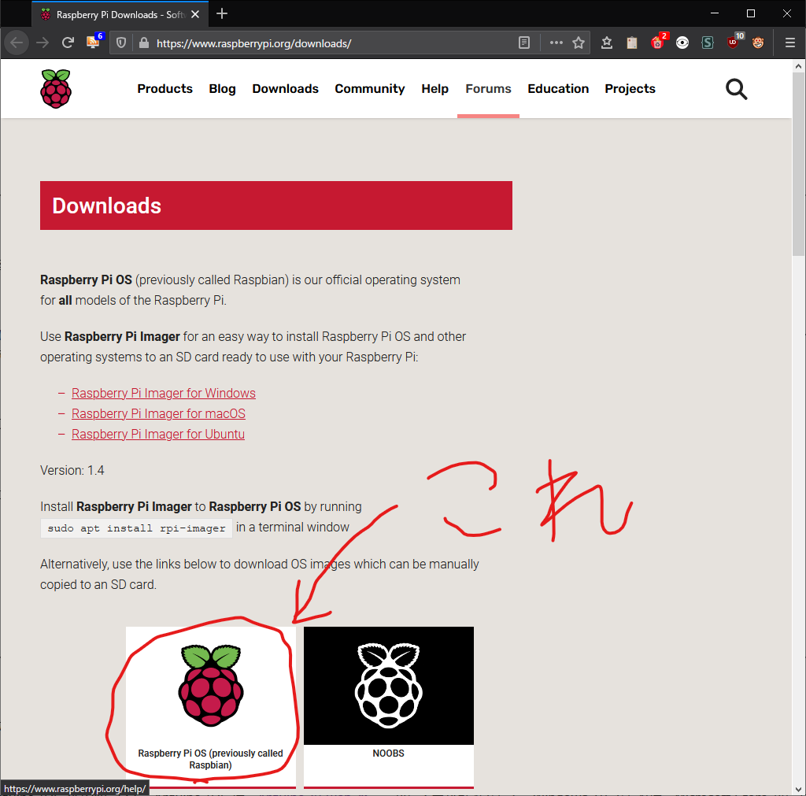
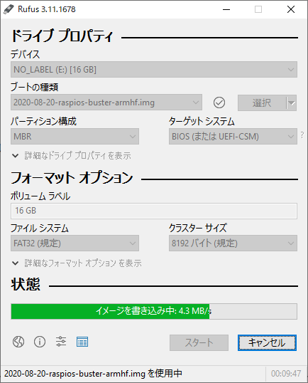
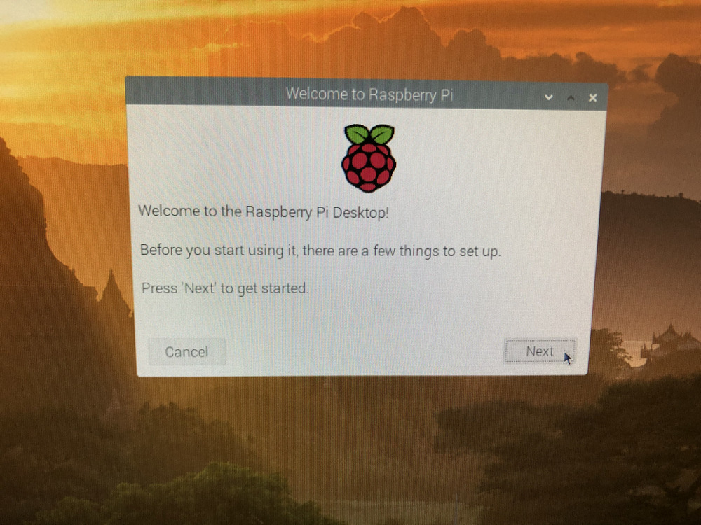
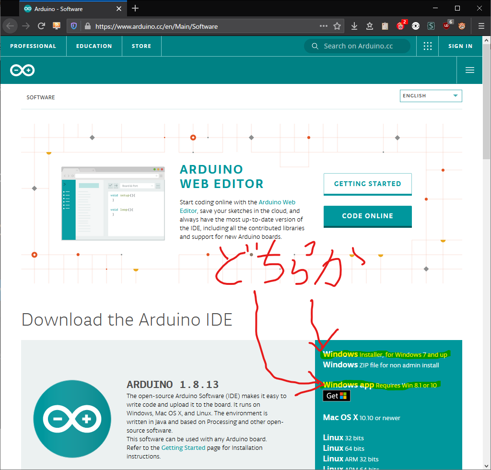

# 説明書

## 目次

1. [Raspberry Pi のセットアップ](#raspi-setup)
2. [Arduino UNO のセットアップ](#arduino-setup)

---

<h2 id="raspi-setup">Raspberry Pi のセットアップ</h2>

自動運転を行うモジュールとして、Raspberry Pi 4 Model B を使用する。この項では、そのセットアップの手順を示す。

### OS イメージ/書き込みソフトの用意

Raspberry Pi 4 Model B を動作させるため、[Raspberry Pi OS](https://www.raspberrypi.org/downloads/) が必要になる。汎用性のために、web ページから OS イメージを直接入手することを強く推奨する。GNU/Linux では `dd` のようなプログラムで OS イメージを書き込むことが出来るが、Windows 環境では、[Rufus](https://rufus.ie/) のようなイメージを書き込むソフトウェアも用意する必要がある。



### SD カードへの OS の書き込み

Windows では、Rufus のようなソフトウェアを使用して書き込む。Rufus を起動し、SD カードを選択後、ウィンドウ内にイメージファイルをドラック & ドロップし、\"スタート\"をクリックする。 Rufus 以外のソフトウェアを使用する場合は、各ソフトウェアのドキュメントを参照すること。



### 実行環境の準備

画面上の指示に従い、OS をセットアップする。



セットアップ後、端末エミュレータを開き、以下のコマンドを入力して、実行環境の準備を行う。

```
# apt update
# apt upgrade
pda# apt install expect python3 python3-opencv
```

### コードの準備

Python のプログラムを `scp` コマンドや USB メモリでコピーして、Raspberry Pi 上から実行できるようにする。もしくは、下記のコマンドで GitHub 上のリポジトリからデータを取得しても良い (あらかじめ `git` をインストールしておく必要がある)。

```
$ git clone --depth 1 https://github.com/mak1non/project.git
```

また、GitHub 上のコードに変更があった場合は、コードの存在するディレクトリに移動した上で、以下のコマンドを実行する事で更新が出来る。

```
$ git pull origin master
```

---

<h2 id="arduino-setup">Arduino UNO のセットアップ</h2>

模型車両の制御には、Arduino UNO を利用する。この項では、セットアップ手順を示す。

### 開発環境の準備

模型車両を操作するプログラムを Arduino UNO に書き込むために、Arduino IDE が必要になる。Arduino IDE は、[Arduino の web ページ](https://www.arduino.cc/en/Main/Software)から入手が可能である。Windows 10 であれば、Microsoft Store からも入手が可能である。




### プログラムの書き込み

執筆中
