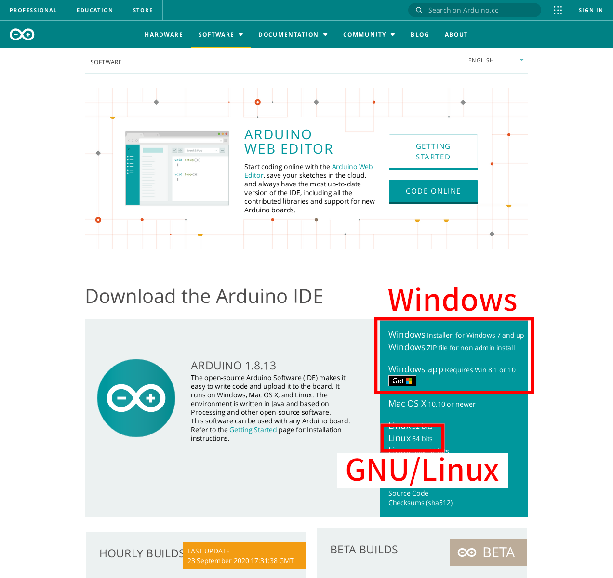

# 説明書

## 目次

1. [Raspberry Pi のセットアップ](#raspi-setup)
2. [Arduino UNO のセットアップ](#arduino-setup)
3. [配線](#cabling)
4. [車両の組み立て](#assembly)

注: コマンド例の中の `$` は通常ユーザーで実行するコマンド、`#` は特権ユーザーで実行するコマンドを示す。大抵の場合、`sudo` 等を用いる事で特権ユーザーとしての実行が可能。

---

<h2 id="raspi-setup">Raspberry Pi のセットアップ</h2>

自動運転を行うモジュールとして、Raspberry Pi 4 Model B を使用する。この項では、そのセットアップの手順を示す。

### OS イメージ/書き込みソフトの用意

Raspberry Pi 4 Model B を動作させるため、[Raspberry Pi OS](https://www.raspberrypi.org/downloads/) が必要になる。汎用性のために、web ページから OS イメージを直接入手することを強く推奨する。GNU/Linux では `dd` のようなプログラムで OS イメージを書き込むことが出来るが、Windows 環境では、[Rufus](https://rufus.ie/) のようなイメージを書き込むソフトウェアも用意する必要がある。


### SD カードへの OS の書き込み

GNU/Linux では、以下のコマンドで書き込みをする事ができる。

```
# dd bs=1M if=<Raspberry Pi OS のイメージファイル> of=<SDカード (例: /dev/sdb)>
```

Windows では、Rufus のようなソフトウェアを使用して書き込む。Rufus を起動し、SD カードを選択後、ウィンドウ内にイメージファイルをドラック & ドロップし、\"スタート\"をクリックする。 Rufus 以外のソフトウェアを使用する場合は、各ソフトウェアのドキュメントを参照すること。


### 実行環境の準備

画面上の指示に従い、OS をセットアップする。


セットアップ後、端末エミュレータを開き、以下のコマンドを入力して、実行環境の準備を行う (手動で入力するのは大変なので、コピー/ペーストする事を強く推奨する)。これにより、Python3 と OpenCV に必要なソフトウェアを取得する。

```
# apt update
# apt upgrade
# apt install python3 python3-pip python3-venv libaom0 libatk-bridge2.0-0 libatk1.0-0 libatlas3-base libatspi2.0-0 libavcodec58 libavformat58 libavutil56 libbluray2 libcairo-gobject2 libcairo2 libchromaprint1 libcodec2-0.8.1 libcroco3 libdatrie1 libdrm2 libepoxy0 libfontconfig1 libgdk-pixbuf2.0-0 libgfortran5 libgme0 libgraphite2-3 libgsm1 libgtk-3-0 libharfbuzz0b libilmbase23 libjbig0 libmp3lame0 libmpg123-0 libogg0 libopenexr23 libopenjp2-7 libopenmpt0 libopus0 libpango-1.0-0 libpangocairo-1.0-0 libpangoft2-1.0-0 libpixman-1-0 librsvg2-2 libshine3 libsnappy1v5 libsoxr0 libspeex1 libssh-gcrypt-4 libswresample3 libswscale5 libthai0 libtheora0 libtiff5 libtwolame0 libva-drm2 libva-x11-2 libva2 libvdpau1 libvorbis0a libvorbisenc2 libvorbisfile3 libvpx5 libwavpack1 libwayland-client0 libwayland-cursor0 libwayland-egl1 libwebp6 libwebpmux3 libx264-155 libx265-165 libxcb-render0 libxcb-shm0 libxcomposite1 libxcursor1 libxdamage1 libxfixes3 libxi6 libxinerama1 libxkbcommon0 libxrandr2 libxrender1 libxvidcore4 libzvbi0
```


### コードの準備

Python のプログラムを `scp` コマンドや USB メモリでコピーして、Raspberry Pi 上から実行できるようにする。もしくは、下記のコマンドで GitHub 上のリポジトリからデータを取得しても良い (あらかじめ `git` をインストールしておく必要がある)。

```
$ git clone https://github.com/mak1non/project.git
```

また、GitHub 上のコードに変更があった場合は、コードの存在するディレクトリに移動した上で、以下のコマンドを実行する事で更新が出来る。

```
$ git pull origin master
```

### Python3 仮想環境の準備

Python から OpenCV を使用するためのライブラリをインストールするが、その際、venv と呼ばれる Python 用の仮想環境を作成し、その中にインストールする事を強く推奨する。以下のコマンドをコードの存在するディレクトリ上で実行することで仮想環境の作成、必要なライブラリの取得が可能である。

```
$ python3 -m venv .venv
$ source .venv/bin/activate
$ pip install -r requirements.txt
```

---

<h2 id="arduino-setup">Arduino UNO のセットアップ</h2>

模型車両 (モーター) の制御には、Arduino UNO を利用する。この項では、セットアップ手順を示す。

### 開発環境の準備

模型車両を操作するプログラムを Arduino UNO に書き込むために、Arduino IDE が必要になる。Arduino IDE は、[Arduino の web ページ](https://www.arduino.cc/en/Main/Software)から入手が可能である。Windows 10 であれば、Microsoft Store からも入手が可能である。




GNU/Linux の場合、ダウンロードしたファイルを以下の手順で展開し、インストールする必要がある。

```
$ cd <ファイルの場所>
$ tar xvf arduino-<バージョン番号>-linux64.tar.xz
$ cd arduino-<バージョン番号>
# ./install.sh
# ./arduino-linux-setup.sh <ユーザー名>
```

最後の `arduino-linux-setup.sh` 内での設定を反映させるため、一度 PC を再起動する必要がある。

MacOS を使用する場合は、Arduino 公式のドキュメントを参照すること。

### プログラムの書き込み

まず、スケッチを読み込む。


次に `Tools` タブから、書き込み先の Arduino UNO に合わせた書き込み設定をする。

| 項目名     | 内容                        |
| ---------- | --------------------------- |
| Board      | Arduino Uno                 |
| Port       | /dev/<接続先> (Arduino Uno) |
| Programmer | AVRISP mkII                 |

設定した後、1 度 `Sketch -> Verify/Compile` を実行し、プログラムの構文が問題無い事を確認する。確認後、`Sketch -> Upload` で Arduino UNO へプログラムを書き込む。


---

<h2 id="cabling">配線</h2>

製作中

---

<h2 id="assembly">車両の組み立て</h2>

製作中
